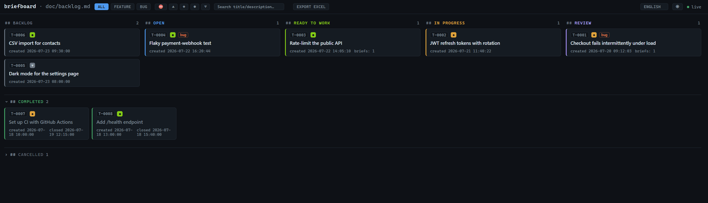

# briefboard

[English](README.md) | Русский | [日本語](README.ja.md)

[](https://www.npmjs.com/package/briefboard)
[](https://github.com/shinKatana0/briefboard/actions/workflows/test.yml)
[](LICENSE)
[](#требования)

*Этот перевод обновляется к релизу. Ведущая версия — английская
([README.md](README.md)); между релизами она может быть впереди этой.*

Лёгкая канбан-доска + CLI для того, чтобы AI-агенты вели работу над задачами
через строгий воркфлоу `backlog → open → ready → in_progress → review → done`,
с обязательными брифами перед стартом реализации и ревью перед мержем.

> Пакет опубликован в npm под именем `briefboard` — `npx briefboard init`
> разворачивает его в любой проект (см. раздел «Быстрый старт» ниже).
> Клонирование репозитория — альтернатива для контрибьюторов и разработки.
> Если вы искали `agentboard` — так проект назывался раньше; сейчас и пакет,
> и репозиторий называются `briefboard`.



## Зачем это нужно

Агенты, которые работают напрямую по разговору с пользователем, легко теряют
структуру: непонятно, что уже решено, что ещё в работе, кто и почему принял
то или иное решение. `briefboard` кладёт поверх любого агентного
инструмента (Claude Code, Codex и т.п.) простой формальный процесс —
бэклог задач, обязательный бриф перед реализацией и ревью перед мержем —
и живую доску, на которой это всё видно человеку в реальном времени.

## На чём это проверялось

По устройству briefboard не привязан ни к конкретному агенту, ни к конкретной
платформе: он запускает настроенную вами команду и пишет обычные файлы. Реально
проверено меньше, и одно от другого стоит отличать до того, как вы возьмёте его
в работу:

- **Агент: Claude Code.** Все готовые к копированию команды здесь гонялись на
  Claude Code 2.1.232. Подойти должен любой CLI, отвечающий [четырём
  требованиям](#что-briefboard-требует-от-агента), потому что весь интерфейс
  этим и исчерпывается, — но второго здесь не пробовали, так что это свойство
  конструкции, а не проверенное обещание.
- **Платформа: Windows 11**, на ней сделаны все замеры. Linux проверен тестами:
  весь набор проходит зелёным в Debian-контейнере (`node:22-bookworm`), причём
  два теста пропускают там сами себя — то, что они проверяют, бывает только на
  Windows. Уборка оставшихся процессов гонялась в том же контейнере, и этот
  прогон нашёл настоящую дыру, которой на Windows не было. Чего на Linux не
  делали — так это замеров: все числа здесь получены на Windows. **macOS не
  запускался ни разу** — там `ps` сообщает время старта процесса по-своему и
  диапазон pid другой, — поэтому он не поддерживается, пока кто-нибудь этого не
  сделает.

Ни одно из этих ограничений нигде не проверяется: никто не спрашивает, какой у
вас агент и какая операционная система, и ничто не отказывается стартовать. Они
говорят о том, что проверено, а не о том, что запрещено.

## Быстрый старт

**Полное руководство пользователя:** подробный пошаговый разбор (установка,
первый запуск, жизненный цикл задачи от начала до конца, справочник по CLI,
UI доски и решение проблем) — см.
[руководство пользователя](https://github.com/shinKatana0/briefboard/blob/main/doc/guide/guide.ru.md).

Разверните его в любой проект командой `npx briefboard init` — она скопирует
`server/`, `tools/`, `ui/`, `agents/`, `AGENTS.md`, `CLAUDE.md` в текущую
директорию и создаст пустые `doc/backlog.md` + `doc/brief/`:

```bash
npx briefboard init
npx briefboard serve
# → доска на http://localhost:4571 или на следующем свободном порту, если он занят

node tools/task.mjs add --type feature --priority Major --title "..." --desc "..."
```

Как альтернатива — для контрибьюторов или разработки — клонируйте репозиторий
и работайте прямо в нём:

```bash
git clone <url-этого-репозитория>
cd briefboard

node server/server.js
node tools/task.mjs add --type feature --priority Major --title "..." --desc "..."
```

## Как это работает

Источник правды — файл `doc/backlog.md` (плюс брифы в `doc/brief/`), обычный
markdown. Каждая задача проходит через фиксированные статусы:

```
backlog ──▶ open ──▶ ready ──▶ in_progress ──▶ review ──▶ done
   │          │        │            │             │
   └──────────┴────────┴────────────┴─────────────┴──▶ cancelled
                                        review ──▶ in_progress (если не прошла ревью)
                                        open ──▶ backlog (положить обратно)
```

- **backlog** — задача только зафиксирована.
- **open** — обсуждена, решение принято.
- **ready** — на задачу написан бриф (без брифа перевести в `ready` нельзя).
- **in_progress** — воркер реализует задачу по брифу в отдельной ветке.
- **review** — воркер сдал задачу, оркестратор проверяет и гоняет тесты.
- **done** / **cancelled** — задача смержена или отменена.

Две роли:

- **Оркестратор** — ведёт бэклог, пишет брифы, распределяет задачи, проводит
  ревью и мержит. Единственный, кто ставит статусы `backlog/open/ready/review/done/cancelled`.
- **Воркер** — берёт задачу в `ready`, реализует ровно то, что описано в
  брифе, переводит `ready → in_progress` и `in_progress → review`.

Точный формат `doc/backlog.md` и `doc/brief/*.md`, правила записи и
разрешённые переходы статусов — в `agents/PROTOCOL.md` (единственный
источник правды по формату, здесь пересказано только своими словами).
Инструкции для ролей — `agents/ORCHESTRATOR.md` и `agents/WORKER.md`.

Закрытые задачи копятся — и продолжают копиться после каждой уборки: в этом
репозитории 64 из 78 задач в `doc/backlog.md` — `done` или `cancelled`, 307 КБ
из 335-килобайтного файла, который агент читает целиком, а ещё 147 уже лежат в
архиве от предыдущей уборки. `node tools/task.mjs archive` переносит их в
`doc/backlog-archive.md`, в том же формате и по-прежнему под git. Ничего не
теряется и для вас ничего не меняется — доска читает оба файла и продолжает
показывать Завершённые и Отменённые ровно как раньше; уменьшается то, что агент
платит за чтение бэклога (здесь 335 КБ → 28 КБ, примерно 89k токенов → 7k).

## UI доски

- Колонки по статусу: В бэклоге → Открыта → Готова → В работе → Ревью;
  Завершённые и Отменённые — сворачиваемые полосы под доской.
- Фильтр по типу задачи (все / feature / bug / external).
- Поиск по названию, описанию, ID и меткам задачи.
- Мультиселект-фильтр по приоритету (Blocker / Critical / Major / Medium / Minor).
- Свои собственные метки: чипы на карточке, редактор в диалоге карточки и
  мультиселект-фильтр `Labels ▾` в шапке. Метку нигде не объявляют — она
  существует, пока её несёт хоть одна задача, а создать её означает набрать в
  редакторе новое имя (`node tools/task.mjs labels T-0007 ui,docs` делает то же
  самое из терминала). Задачу можно завести уже с метками — `add --labels` и
  поле в форме «+», — чтобы проект, в котором размечена каждая задача, не
  зависел от того, вспомнят ли про вторую команду.
- Переключение темы: light / dark.
- Переключение языка интерфейса: EN / RU / JA.
- Кнопка «+ Новая задача» — первая в шапке, рядом с названием — заводит задачу
  (название, тип, приоритет, метки, описание) прямо с доски; она всегда попадает
  в `backlog`.
- Drag&drop карточки из «Бэклога»/«Открыта» на полосу «Отменённые» — быстрая
  отмена задачи прямо из UI.
- Drag&drop карточки из «Бэклога» в колонку «Открыта» — перевод задачи в работу
  без подтверждения, ровно переход `backlog` → `open` (и, если она настроена,
  агентская сессия — см. ниже).
- Drag&drop карточки из «Открыта» обратно в «Бэклог» — положить её обратно:
  карточку, которую втащили по ошибке, или ту, от которой сейчас решили
  отказаться. Сам перенос подтверждения не спрашивает — он обратим; доска
  спрашивает про идущую по этой карточке брифинг-сессию, потому что перенос её
  останавливает. Ничего не стирается: брифы, описание, все вопросы и ответы
  остаются на месте. Из «Готова» такого хода нет — см. жизненный цикл в
  `agents/PROTOCOL.md`.
- На карточке в «Открыта» есть кнопка «Запустить брифинг-сессию» (если команда
  брифинга настроена). Это то, чего дроп в «Открыта» больше не делает для задачи
  с уже написанным брифом: жмите её, когда бриф устарел, когда сессия умерла, не
  успев его написать, или когда вернувшейся из бэклога задаче нужно пересмотреть
  бриф. Она не меняет статус и не заменяет ничего уже написанного.
- Drag&drop карточки из «Готова к работе» в колонку «В работе» — задача берётся
  в работу: переход `ready` → `in_progress` и, если она настроена, воркер-сессия
  (см. ниже). Здесь дроп спрашивает подтверждение: запускается агент, который
  пишет код и коммитит его. Карточку с незакрытыми пререквизитами колонка не
  принимает вовсе и даже не подсвечивается под неё.
- Карточка в «Ревью» несёт на себе конец работы: доска спрашивает у git, влита
  ли ветка задачи, даёт готовую к копированию строку мержа и предлагает
  «Принять» (`review` → `done`, с подтверждением) и «Убрать worktree» — каждое
  из этих действий, пока ветка не влита или дерево не чистое, отказывает и
  называет причину. Сам мерж доска не делает никогда: это решение, и оно
  остаётся вашим.
- Зависимости между задачами: карточка с незакрытыми пререквизитами помечена
  «заблокирована», в карточке задачи они перечислены с текущим статусом и
  кликабельны, а переход `ready → in_progress` до их закрытия запрещён.
- Бейдж блокировки называет блокер («ждёт: получить ключи у клиента»), а не
  только его идентификатор; несколько блокеров он считает, а полный список
  «id — заголовок» показывает в тултипе. Переключатель «Заблокированные» в шапке
  оставляет на доске только задачи, которые чего-то ждут.
- Сторож сверяет то, что заявляет карточка, с тем, что показывают git и реестр
  сессий, и там, где эти двое расходятся, ставит на карточку янтарную плашку:
  задача в работе, сессия по ней закончилась, а в ветке есть коммиты; задача на
  ревью без ветки; завершённая задача, чья ветка так и не влита. Он только
  сообщает: статусов не пишет и ничего не мержит, а карточки, о которых ему
  сказать нечего, не несут ничего. `BRIEFBOARD_WATCHDOG_MS` задаёт, как редко он
  вправе спрашивать git: `10000` мс — это и значение по умолчанию, и пол, а
  меньшее значение — включая `0` — поднимается до пола, и на stderr выходит
  строка со словами `Write "off" to stop the board asking git at all.`
- Тип задачи `external` — для того, что нам должна третья сторона: доступы,
  ключи, ответ заказчика, чужой релиз. Заведите ожидание отдельной карточкой,
  повесьте на неё `depends` реальной работы — и ожидание станет видимым и
  закрываемым вместо того, чтобы жить в прозе или в задаче, застрявшей «в работе».
- Кнопка `⏻` в шапке останавливает доску: она спрашивает подтверждение, после
  чего процесс `node server/server.js` завершается, а страница показывает, что
  доска остановлена, вместо попыток переподключиться. Умирает только процесс
  доски — терминал, в котором она была запущена, просто возвращает промпт.
  Работающие агентские сессии убиваются вместе с ней, ровно как при Ctrl+C, а
  ожидание после убийства ограничено — см. раздел про сессии ниже.
  Запрос принимается только с loopback-адреса.
- Экспорт текущей доски в Excel (`.xlsx`) одной кнопкой.
- Live-обновление: доска сама перерисовывается при изменении `doc/backlog.md`
  на диске (SSE + `fs.watch`), без перезагрузки страницы.

## Агентские сессии (opt-in, по умолчанию выключено)

Агентскую сессию запускают два дропа на доске, и у каждого своя команда:
**брифинг**-сессия при дропе карточки в «Открыта» и **воркер**-сессия при дропе в
«В работе».

Брифинг-сессия делает ровно одно: проводит рефайнмент, пишет бриф в
`doc/brief/`, ставит задаче `ready` и завершается — либо возвращается с
вопросами (см. ниже). Дальше вы сами читаете бриф и
решаете, отдавать ли задачу воркеру: разговор о рефайнменте — единственное место,
где этот процесс ловит непонятые требования, поэтому он не автоматизируется
насквозь.

**Она запускается один раз, а не на каждый дроп.** Дроп в «Открыта» запускает
брифинг-сессию только для задачи, у которой брифа **ещё нет**. Задача, у которой
он уже есть, поднимается обратно из бэклога, и написать поверх первого брифа
второй — не то, о чём просил дроп карточки, поэтому дроп её просто переносит.
А когда этот бриф действительно надо пересмотреть, сказать об этом можно кнопкой
«Запустить брифинг-сессию» на карточке.

### Маршрут карточки и ваше место в нём

```
кнопка «+» ──▶ Бэклог ──дроп──▶ Открыта ──▶ Готова ──дроп──▶ В работе ──▶ Ревью ──▶ Завершена
                        (брифинг-сессия)      (вы читаете   (воркер-сессия)   (вы делаете
                                               бриф)                           ревью и мерж)
```

Оба дропа — осознанные действия человека, который видел предыдущий шаг: задачу
открывают, когда хотят её отрефайнить, и берут в работу только прочитав
получившийся бриф. Никто не прогоняет карточку от `backlog` до `done` сам.

**Мерж — ваш и остаётся ручным.** Ветки доска не мержит никогда: проверить работу
и признать её хорошей — ровно то место, где человек незаменим, поэтому оно не
автоматизировано вообще. Что доска на этом конце делает — то, что она может
проверить и чего ничем не отменяет: она читает, состоялся ли ваш мерж, и, когда
он состоялся, позволяет принять задачу и убрать worktree прямо с карточки.

Фича **выключена по умолчанию**: пока команда не задана, ни один процесс не
порождается. Дефолтной команды тоже нет — briefboard ничего не предполагает о том,
каким агентом вы пользуетесь.

### Что briefboard требует от агента

Доска запускает команду, даёт ей каталог и читает то, что она напечатала. Всё
остальное — дело агента, так что за сессией может стоять любой CLI, умеющий эти
четыре вещи, и свой стоит сверить с ними до того, как писать шаблон:

- **отработать один промпт и завершиться.** Команда порождается, и завершение
  процесса — это то, что доска считает концом сессии. CLI, который открывает
  интерактивный разговор и ждёт вас, не закончит ни одной.
- **работать без терминала.** stdin закрыт, и отвечать на запрос нечем, поэтому
  логин, подтверждение или вопрос о правах должны быть улажены *до* старта
  сессии, а не во время неё.
- **читать и писать файлы в своём рабочем каталоге.** Задача, брифы и код — это
  файлы; доска передаёт ID задачи и каталог, и больше ничего.
- **выполнять `node tools/task.mjs`.** Это единственный способ сессии отчитаться:
  статус, ссылка на бриф, отчёт, вердикт, вопрос. Агент, который не может
  выполнить команду, прочитает ваш репозиторий, но не сдвинет ни одной карточки.

Больше не требуется ничего, и формат вывода не требуется тоже: сессия, которая не
напечатала вообще ничего, — по-прежнему валидная сессия. Единственная фича,
которая читает вывод, — счётчик токенов, и только потому, что вы сами объясняете
ей как (см. [что стоила задача](#что-стоила-задача)).

**Какие части команд ниже — не briefboard'а.** Всё, что идёт после промпта: `-p`,
`--allowedTools`, `--disallowedTools`, `--output-format`,
`--dangerously-skip-permissions`. Это синтаксис одного агентского CLI, проверенный
запуском на Claude Code 2.1.232. briefboard только разбирает ваш шаблон на
аргументы и запускает его, поэтому на другом CLI те же флаги пишутся иначе, живут
в конфиге или не существуют вовсе. briefboard'у принадлежат короткий список выше,
плейсхолдеры `{id}` и `{profile}` и переменные `BRIEFBOARD_*`.

**Умолчание, которое не переносится, — то, что про права.** Всё написанное здесь
про отсутствующее разрешение описывает агента, который отказывается от вызова
инструмента и тихо завершается: это умолчание Claude Code, и стоит оно вам
сессии, которая ничего не сделала. Другой CLI может по умолчанию поступать ровно
наоборот и просто выполнять всё, что ему велели. Тогда предупреждения отсюда
читаются как успокоение, а сбой становится зеркальным: не сессия, которая ничего
не записала, а сессия, которая записала то, чего никто не разрешал. Выясните,
какое из двух умолчаний у вашего агента, до того как направлять на него доску, —
от ответа зависит, список прав это страховка или единственное, что стоит между
агентом и вашим репозиторием.

### Два исхода сессии

Сессия работает headless: stdin закрыт, терминала нет — спросить вас по ходу
работы она не может. Отсюда ровно два честных исхода, и промпт ниже проговаривает
оба:

1. **Требования ясны** — сессия пишет бриф и ставит задаче `ready`.
2. **Есть хотя бы один существенный вопрос** — `ready` **не** ставится. Сессия
   дописывает в конец описания задачи секцию `### Session questions`, по одному
   вопросу на пункт, оставляет задачу в `open` и завершается.

Второй исход — это успех, а не сбой: агент, который угадал и всё равно поставил
`ready`, выдаёт официально выглядящий бриф, который никто не проверял, и по нему
потом пишут код. На доске такая карточка помечена **ждёт ответа**, поэтому
задачи, ожидающие вас, видно сразу.

```bash
# Claude Code — готовая строка:
BRIEFBOARD_SESSION_CMD='claude -p "Take task {id} from doc/backlog.md and act per agents/ORCHESTRATOR.md.
First read the task and its whole description.
If the requirements are clear: write the brief into doc/brief/ and set the task to ready.
If you have even one substantive question: do NOT set ready. Append a section titled
### Session questions
to the end of the task description, one concrete answerable question per bullet, leave the task in open, and stop.
Never invent an answer for the user, and never bury a doubt in the text of the brief.
If that section is already there and now carries answers: take them into account, write the brief, set ready."
--allowedTools "Read,Glob,Grep,Edit(doc/brief/**),Bash(node tools/task.mjs:*)"' \
  node server/server.js
```

Заголовок ищется как одна точная строка, стоящая отдельно, — оставьте его
дословно: именно эту строку и проверяет доска. Английский он намеренно: это токен
формата, как `- status:` или `## T-NNNN`, а не проза. Сами вопросы и описания
задач пишите на любом языке.

### Права инструментов: без них сессия ничего не запишет

У headless-сессии нет терминала, и разрешение спрашивать не у кого. Агент
блокирует вызов инструмента, вежливо пишет об этом в лог и завершается с кодом
**0** — доска показывает сессию, которая отработала и закончилась, задача никуда
не сдвинулась, и не записано ни байта. Поэтому команда выше заканчивается явным
списком `--allowedTools`, и поэтому его стоит прочитать до того, как копировать:
эта строка — то место, где вы решаете, что агенту позволено в вашем репозитории.

- **Флаги идут ПОСЛЕ промпта.** `--allowedTools` принимает список, так что
  `claude -p --allowedTools Read Edit "…промпт…"` съедает промпт как ещё одно имя
  инструмента и падает с `Input must be provided either through stdin or as a
  prompt argument`. Сначала промпт, флаги за ним.
- **Список брифинга — маленький.** Читать репозиторий, создать и заполнить один
  файл в `doc/brief/`, выполнять `node tools/task.mjs` (brief, status, note). Ни
  git, ни тестов, ни записи куда-либо ещё — в этом вся работа брифинг-сессии.
- **В списке ревью нет права на запись вообще.** Ревьюер, который может править
  ветку, перестаёт быть способен рассказать вам, что он в ней нашёл, поэтому
  [ревью-сессия](#ревью-сессия-задача-уже-в-ревью) ниже не получает ни `Edit`, ни
  `Write`, а git — только по читающим подкомандам.
- **Права на пути пишутся как `Edit(...)`.** `Write(doc/brief/**)` не совпадает
  ни с чем; `Edit(...)` покрывает все инструменты правки файлов, включая `Write`.
  Голый `Edit` без пути тоже не даёт права на запись.
- **`--dangerously-skip-permissions` — не короткий путь.** Он выключает все
  проверки разом, в вашем рабочем репозитории, где под рукой ваши файлы и ваша
  история git. Это осознанный выбор для песочницы; умолчанием мы его не даём.

Синтаксис принадлежит CLI агента, а не briefboard: списки здесь проверены
запуском на Claude Code 2.1.232, и на другом CLI или сильно более поздней версии
их стоит перепроверить.

**Как отвечать на вопросы.** Откройте карточку: у задачи с пометкой *ждёт
ответа* в диалоге есть поле для ответа. Напишите ответ, оставьте галочку
«Перезапустить брифинг-сессию» и отправьте — текст дописывается в конец описания
под `### Answers`, а сессия запускается снова, уже с ответами перед глазами. Круг
«вопрос → ответ → бриф» замыкается прямо на доске.

Эндпоинт за этим полем умеет **только дописывать**. Ничто из уже написанного в
описании — решения рефайнмента, комментарии ревью, отчёты воркеров — не меняется
и не удаляется никаким вводом. Вопросы и ответы — это переписка, поэтому каждый
открывает свою секцию в порядке написания: спросили, ответили, спросили снова,
ответили снова — четыре секции, и маркер на карточке следует за последней.
Статус он тоже не трогает: задача остаётся в `open`, а `ready`
поставит сессия, когда получит недостающее.

Ответить вручную по-прежнему можно — правкой описания в `doc/backlog.md` или
командой `node tools/task.mjs note <id> --section Answers --text -` — и
перезапустить сессию самому. Чего не выйдет ни так, ни так, — повторно бросить
карточку в Open: задача вышла из `backlog` ещё при первом открытии.

- `BRIEFBOARD_SESSION_CMD` — шаблон команды брифинг-сессии (дроп в «Открыта»).
  `{id}` заменяется на ID задачи (`T-0007`). Пусто или не задано — этот дроп
  ничего не запускает.
- `BRIEFBOARD_WORKER_CMD` — шаблон команды воркер-сессии (дроп в «В работе»),
  настраивается и учитывается отдельно от брифинг-команды. См.
  [воркер-сессию](#воркер-сессия-готова--в-работе) ниже.
- `BRIEFBOARD_ORCHESTRATOR_CMD` — шаблон команды ревью-сессии (кнопка на
  карточке, которая уже в «Ревью»). Не задано — кнопки нет вовсе. См.
  [ревью-сессию](#ревью-сессия-задача-уже-в-ревью) ниже.
- `BRIEFBOARD_SETUP_CMD` — команда, которая делает свежий worktree пригодным для
  работы: `npm ci`, `flutter pub get`, `uv sync` и т.п. Изолированная сессия
  получает *checkout*, в котором нет ни `node_modules`, ни пакетов, ни venv, так
  что проекту с зависимостями это нужно, чтобы тесты в нём вообще запускались.
  Команда выполняется один раз на worktree, с этим worktree в качестве рабочего
  каталога, перед стартом воркер-сессии; брифинг- и ревью-сессии работают в корне
  проекта и её не вызывают. Ненулевой код возврата или работа дольше 10 минут
  убивают команду и отменяют сессию — агент, выпущенный в неподготовленный
  checkout, отчитывается о сбоях, которые не относятся к его задаче. Причина и
  собственный вывод команды уходят в лог сессии строкой
  `[briefboard] setup failed (...)`. Успешный запуск записывается в
  `.briefboard/worktrees/T-0007.setup.json`, и подавляет следующий запуск только
  наличие этого файла: неудавшаяся подготовка повторяется на следующей сессии, а
  удаление файла заставляет прогнать её заново. Не задано — ничего не
  выполняется и ничего об этом не говорится. Цена — одна установка на задачу, и
  платится она на первой её сессии.
- `BRIEFBOARD_SESSION_MAX` — сколько сессий может идти одновременно, суммарно по
  обоим видам (по умолчанию `4`).
- `BRIEFBOARD_PROFILES` — профили запуска, которые объявляете вы, через запятую.
  Значение подставляется вместо `{profile}` в любой из шаблонов — плейсхолдер вы
  добавляете сами, потому что в готовых командах отсюда его нет. См.
  [профиль запуска](#профиль-запуска-в-каком-режиме-работает-агент) ниже.
- `BRIEFBOARD_TOKENS_RE` — регулярное выражение, первая захватывающая группа
  которого ловит в логе сессии число токенов. Не задано — доска сообщает, сколько
  времени заняла задача, и молчит про токены. См.
  [что стоила задача](#что-стоила-задача) ниже.
- `BRIEFBOARD_TOKENS_MODE` — что означают совпадения: `sum` (по умолчанию)
  складывает все, `last` берёт число последнего совпадения — для агента, который
  печатает нарастающий итог. Любое другое значение не считает ничего и говорит об
  этом при старте. См. [что стоила задача](#что-стоила-задача) ниже.
- Вывод сессии (stdout + stderr) пишется в
  `.briefboard/sessions/T-0007-<timestamp>.log` в корне проекта. Добавьте
  `.briefboard/` в свой `.gitignore`. Логи специально лежат ВНЕ `doc/`: сервер
  следит за `doc/` и на каждое изменение шлёт доске обновление, поэтому лог внутри
  превратил бы каждую строку вывода агента в перерисовку доски у всех клиентов.
- Ответ на дроп сообщает, что произошло: `started`, `briefed` (дроп в «Открыта»
  застал задачу, у которой бриф уже есть, — ничего не порождалось), `disabled`,
  `already-running`, `limit`, `unknown-profile` или `error` — плюс отказы,
  которые может добавить изолированная сессия (см. ниже).

### Windows: агентский CLI, установленный npm-шимом

Команда запускается **без оболочки** — это свойство безопасности раннера, и оно
не изменится. На Windows отсюда следует вот что: глобальная установка через npm
кладёт в PATH `.cmd`-шим, а после hardening'а Node (CVE-2024-27980) файл
`.cmd`/`.bat` вообще нельзя запустить без оболочки (`npm` даёт `ENOENT`,
`npm.cmd` — `EINVAL`). Если ваш агент — такой шим, сессия не стартует; в логе
сервера и в логе сессии появится подсказка с двумя выходами, и оба — в вашем
собственном шаблоне:

- указать настоящий исполняемый файл:
  `BRIEFBOARD_SESSION_CMD='C:\path\to\claude.exe -p "..."'`;
- либо самому обернуть вызов: `BRIEFBOARD_SESSION_CMD='cmd /c claude -p "..."'`.

Второй вариант работает потому, что `cmd.exe` — настоящий исполняемый файл, а
`/c` и всё остальное уходят ему обычными аргументами: оболочку выбираете вы в
своём шаблоне, а не подставляет незаметно раннер. То же касается
`BRIEFBOARD_WORKER_CMD` и `BRIEFBOARD_ORCHESTRATOR_CMD`.

### Изолированные сессии (своя ветка, своё рабочее дерево)

Сессию можно запустить **изолированно**: вместо каталога проекта она получает
собственный git worktree в `.briefboard/worktrees/T-0007` и ветку `task/T-0007`,
созданную от текущего HEAD общего checkout'а. Именно это нужно сессии, которая
пишет код, — а общий checkout сохраняет свои HEAD и ветку, потому что
`git worktree add` — единственная git-команда, которую доска там выполняет.

В worktree попадает то, что **закоммичено**. Всё, что существует только в рабочем
каталоге — и прежде всего незакоммиченный бриф, — в него не попадает; поэтому
задачу и её брифы сессия читает из общего checkout'а (см. воркер-сессию ниже).

**И worktree — это checkout, а не установка.** `git worktree add` выкладывает
отслеживаемые файлы и больше ничего: ни `node_modules`, ни `.dart_tool`, ни venv,
ни `vendor/`. Поэтому бриф, который велит воркеру прогнать тесты, отправляет его
в дерево, где команда тестов падает по причине, никак не связанной с задачей, — а
агент, которому неоткуда это знать, отчитывается о сбое так, будто он задачин.

`BRIEFBOARD_SETUP_CMD` (см. список переменных выше) — ответ на это, и дать его
должны вы: она один раз выполняет ваш `npm ci`, `flutter pub get` или `uv sync`
внутри нового worktree, до того как воркер в нём стартует, и в случае неудачи
отменяет сессию, а не отдаёт неподготовленное дерево. Ничего не объявили —
ничего и не выполняется: worktree остаётся ровно таким же пустым, как раньше, и
это правильное умолчание для проекта, которому установка не нужна, и неправильное
для того, которому нужна. briefboard не угадывает команду: он не знает вашего
стека, а неверная команда установки хуже, чем никакой.

**Цена реальна, и она за задачу.** Одна установка на первой сессии каждой задачи;
для большого тулчейна это может быть дороже самой задачи. Взвешивать её стоит
против альтернативы — агента, который по тому же тарифу разбирается с
отсутствующей зависимостью.

**Если вы предпочитаете, чтобы агент ставил всё сам**, эта команда должна быть в
его собственном списке прав. Воркер, у которого в промпте «прогони тесты», а в
`--allowedTools` нет `Bash(npm ci)`, получает `requires approval` в
headless-сессии, где подтверждать некому, и запуск заканчивается, ничего не
записав (см. [права инструментов](#права-инструментов-без-них-сессия-ничего-не-запишет)).
У setup-команды этой проблемы нет — доска выполняет её сама, а не через агента, —
и это вторая причина предпочесть её.

Если worktree подготовить не удалось, сессия не стартует вовсе, и ответ говорит
почему: `not-a-repo`, `no-git` или `worktree-failed` (сообщение самого git уходит
в лог сессии), а также `setup-failed` или `setup-timeout`, когда не доработала
`BRIEFBOARD_SETUP_CMD`. Тихого отката к запуску в общем checkout'е не бывает.

Worktree **не** удаляется по завершении сессии — в нём лежит результат работы.
Когда ветка влита, за вас это делает кнопка «Убрать worktree» на карточке — и
только пока ветка влита, а дерево чистое; те же две команды руками:

```bash
git worktree remove .briefboard/worktrees/T-0007
git branch -d task/T-0007
```

Изолированно запускается воркер-сессия ниже. Брифинг-сессия остаётся в каталоге
проекта: она только пишет бриф, и ей нужно видеть проект как он есть.

### Воркер-сессия (Готова → В работе)

Дроп карточки из «Готова к работе» в «В работе» берёт задачу в работу и, если
задана `BRIEFBOARD_WORKER_CMD`, запускает по ней воркер-сессию. В отличие от
дропа в Open здесь сначала спрашивается подтверждение — стартует агент, который
пишет код и коммитит его, — и если команда не задана, подтверждение честно об
этом говорит: карточка просто переедет, а работу делать вам.

Сессия запускается **изолированно**: свой git worktree, своя ветка `task/T-0007`
(см. выше). Задачу с незакрытыми пререквизитами с доски начать нельзя вовсе:
сервер отказывает и перечисляет блокеры. Аналога `--force` здесь намеренно нет —
обход блокировки остаётся осознанным действием в CLI
(`node tools/task.mjs status T-0007 in_progress --force`), где он громко
предупреждает.

```bash
# Claude Code — готовая строка:
BRIEFBOARD_WORKER_CMD='claude -p "Implement task {id} from doc/backlog.md per agents/WORKER.md.
You are ALREADY isolated: the board started you in your own git worktree on branch task/{id}. Do not create another worktree or switch branches.
Your worktree was made from the last commit, so a brief written minutes ago and not yet committed is NOT in it. Read the task and its briefs from the SHARED checkout, whose path the board puts in AGENTBOARD_ROOT — print it with: printenv AGENTBOARD_ROOT
node tools/task.mjs show {id}
Then read ALL the briefs it lists, at $AGENTBOARD_ROOT/doc/brief/{id}-*.md — those files, never the doc/brief inside your worktree; do not copy them into it and do not commit them.
Implement exactly what they describe — nothing beyond their scope. Cover the change with tests, and commit each finished piece on your branch as you go — a session cut off by a limit loses everything uncommitted.
Do NOT set the task to in_progress: the drop on the board already did that.
Write the status and your report with the CLI below — it already writes to the backlog of the SHARED checkout, never to the copy inside your worktree, so it needs no path and no environment prefix:
node tools/task.mjs status {id} review
Put the report there with the same CLI, using the note command shown in agents/WORKER.md step 3 — never by editing doc/backlog.md.
Your branch must contain no changes to doc/backlog.md at all.
Anything you find along the way that deserves a card of its own — a bug, a missing capability, scope left outside this task, an external blocker — is filed as a SEPARATE task with the same CLI, with the type that fits it. Do not fix it quietly, do not widen your task, and do not leave it only in the report; file it and carry on:
node tools/task.mjs add --type bug|feature|external --priority Major --title ... --desc Found while working on {id}
If the briefs are unclear or contradictory: do NOT guess and do NOT set review. Append a section titled
### Session questions
to the end of the task description with that same note command, one concrete answerable question per bullet, leave the task in in_progress, and stop.
If that section is already there and now carries answers: take them into account and carry the work on.
If a brief asks you to check how something looks, look: this takes a picture of the board and prints its path, and you read the png like any other file.
node tools/screenshot.mjs --lang en"
--allowedTools "Read,Glob,Grep,Edit(**),Bash(printenv:*),Bash(git:*),Bash(node tools/task.mjs:*),Bash(node tools/screenshot.mjs:*),Bash(npm test),Bash(npm run:*),Bash(node --test:*)"
--disallowedTools "Edit(doc/backlog.md)"' \
  node server/server.js
```

Эти указания — то, без чего запуск бесполезен, и они идут из протокола,
а не из вкуса:

- **не ставить `in_progress`** — дроп это уже сделал, а воркер, который ставит его
  снова, — это воркер, не заметивший, где он находится в жизненном цикле;
- **писать статусы в общий checkout** — доска читает общий `doc/backlog.md`,
  поэтому статус, записанный внутри worktree, не виден до мержа ветки, и карточка
  всё время работы висит в «Готова». Доска делает это свойством сессии, а не тем,
  что агент обязан помнить: каждая сессия запускается с `AGENTBOARD_ROOT`,
  указывающим на проект, так что `node tools/task.mjs` пишет в общий бэклог прямо
  из worktree — забывать префикс больше нечего.
- **и брифы читать оттуда же** — worktree создаётся от текущего HEAD, а бриф,
  написанный брифинг-сессией пару минут назад, — неотслеживаемый файл, и в
  worktree его просто нет. Воркер, заглянувший в `doc/brief/` у себя под ногами,
  не находит ничего и начинает угадывать, пока вы смотрите на этот бриф у себя на
  экране. Тот же `AGENTBOARD_ROOT`, который выносит статус наружу, указывает и на
  брифы, которые надо прочитать.
- **заводить найденное отдельной задачей** — у воркера, встретившего баг,
  недостающую возможность или кусок объёма за пределами своего брифа, есть три
  соблазнительных способа это потерять: починить молча (лишнее никто не
  ревьюил), проглотить в свою задачу или упомянуть в отчёте, который читают один
  раз. `tools/task.mjs add` и так есть в списке прав сессии, а эта строка —
  то, что превращает его в карточку. Заблокированная запись статуса хотя бы
  оставляет на доске застрявшую карточку; находка, не дошедшая до бэклога, не
  оставляет ничего.
- **коммитить по ходу дела** — сессия заканчивается по лимиту или таймауту, ни о
  чём не спрашивая, и работа, не вышедшая из рабочего дерева, заканчивается
  вместе с ней. Замерено здесь: из трёх воркер-сессий, убитых так за один день, у
  двух были изменённые файлы и ни одного коммита. `agents/WORKER.md`, шаг 2,
  говорит то же самое и со второй причиной тоже; промпт это повторяет, потому что
  промпт — то, что сессия читает первым.

Доска не решает это тем, что коммитит бриф за вас: коммит в вашем репозитории, в
вашей ветке, мимо вашего ревью — не то, что инструмент делает у вас за спиной. И
не копирует `doc/` в worktree: вторая копия бэклога становится вторым бэклогом в
тот момент, когда её кто-нибудь правит. Данные задач одни — в общем checkout'е, —
и каждая сессия читает и пишет ровно их.

Список прав у воркера длиннее, чем у брифинга, ровно настолько, насколько шире
работа: он правит код, гоняет тесты и коммитит. Четыре вещи в нём — не
украшение:

- **`Bash(printenv:*)`** — то, чем сессия узнаёт, где общий checkout. Переменная
  и так лежит в её окружении, но путём, по которому можно открыть файл, её делает
  вызов инструмента: без этого правила бриф остаётся нечитаемым за неимением
  каталога.
- **`--disallowedTools "Edit(doc/backlog.md)"`** превращает «в твоей ветке не
  должно быть изменений `doc/backlog.md`» из просьбы в факт. Статус при этом
  доходит до доски — он идёт через `tools/task.mjs`, а не через редактор.
- **`Bash(node tools/screenshot.mjs:*)`** — единственный способ для сессии
  увидеть. Бриф со словами «шапка не должна переноситься по-японски» без этого
  правила непроверяем: запуска сервера в списке нет, а в headless-сессии
  разрешить его некому (T-0143 — критерий, который в итоге не проверил никто).
  Дверь узкая нарочно: сессии позволено сфотографировать доску, но не даётся
  право запускать в вашем репозитории произвольные процессы или браузер, — ту же
  черту уже проводит `Bash(node tools/task.mjs:*)`.
- **Правила для тестов подгоняются под ваш проект.** `Bash(npm test)` и
  `Bash(npm run:*)` подходят этому репозиторию; поставьте туда свой прогон.
  `Bash(git:*)` — это все команды git; такова цена агента, который коммитит, и
  причина, по которой сессия получает свой worktree и свою ветку.

**У воркер-сессии те же два исхода, что и у брифинговой.** Либо она доводит
задачу до `review`, либо у неё есть настоящий вопрос и она его задаёт — потому что
третий вариант, угадать по неясному брифу, даёт закоммиченный код, написанный по
непроверенному требованию. Когда она спрашивает, задача **остаётся в
`in_progress`**: протокол разрешает воркеру ровно два перехода, и ни один не ведёт
назад, поэтому статус по-прежнему говорит о фазе, а о том, что работа стоит,
говорит маркер **ждёт ответа**. Карточка в «В работе» с этим маркером ждёт вас, а
не работает.

Отвечаете вы ей из карточки ровно так же, как брифинговой, и галочка перезапуска
перезапускает **воркер**-сессию — в её worktree, на её ветке и с ответами в
описании перед глазами.

Когда сессия закончит, ветка ждёт вас: прочитайте диф, прогоните тесты, смержите
и сами поставьте задаче `done`. Сессия ниже может прочитать и прогнать за вас —
решить она не может.

### Ревью-сессия (задача уже в «Ревью»)

На карточке в **«Ревью»** есть кнопка: *Запустить ревью-сессию*. Сессия читает
диф ветки и брифы, гоняет тесты и дописывает в описание задачи секцию
`### Review verdict` — и эта секция целиком её результат.

**Она не ставит никакого статуса и ничего не мержит.** И `done` — в последнюю
очередь: `done` значит «я это принял», а мерж — это решение. Сессия готовит ваше
решение, но не принимает его. Поэтому здесь кнопка, а не дроп: задача уже в
«Ревью», её туда перевёл сам воркер, так что двигать её некуда и менять в её
статусе нечего. И поэтому же в списке прав ниже нет способа писать код: ревьюер,
который тихо чинит найденное, больше не рассказывает вам, что он нашёл.

Работает она **в каталоге проекта**, а не в собственном worktree: диф, который
она читает, принадлежит ветке, созданной воркером, а вердикт уходит в общий
бэклог. Worktree поставил бы её на копию, где нет ни того, ни другого.

```bash
# Claude Code — готовая строка:
BRIEFBOARD_ORCHESTRATOR_CMD='claude -p "Review task {id} of this project and write a verdict.
The board started you in the project directory — do not create a worktree and do not switch branches. Its path is in AGENTBOARD_ROOT: printenv AGENTBOARD_ROOT
The --full below is what prints the worker report, which you are reviewing; without it show leaves reports out:
node tools/task.mjs show {id} --full
Read ALL the briefs it lists, at $AGENTBOARD_ROOT/doc/brief/{id}-*.md
The work is on branch task/{id}. Read what it changed, without checking anything out:
git log --oneline HEAD..task/{id}
git diff HEAD...task/{id}
Run the tests on that branch in the worktree the worker left behind, which is that branch checked out:
cd .briefboard/worktrees/{id} && npm test
If that directory is not there, do not test something else — say so in the verdict.
Write your verdict with this CLI, and it is your ONLY output. The text comes from stdin, so use a heredoc as agents/WORKER.md step 3 shows:
node tools/task.mjs note {id} --section '\''Review verdict'\'' --text -
Say in it: which acceptance criteria of the briefs are met and which are not, what the tests did, what you would change, and plainly whether you would merge it.
Do NOT set any status, done least of all. Do NOT merge, do NOT rebase, do NOT delete the worktree. You have no permission to write code, and that is deliberate: report what you found, do not repair it.
If the briefs or the diff leave you unable to judge: append a section titled
### Session questions
with that same note command, one concrete answerable question per bullet, leave the task in review, and stop.
A criterion about how something looks is judged by looking, not by reading the diff — this photographs the board and prints the path of the png, which you read like any other file:
node tools/screenshot.mjs --lang en"
--allowedTools "Read,Glob,Grep,Bash(printenv:*),Bash(cd:*),Bash(git log:*),Bash(git diff:*),Bash(git show:*),Bash(git status:*),Bash(git branch:*),Bash(node tools/task.mjs:*),Bash(node tools/screenshot.mjs:*),Bash(npm test),Bash(npm run:*),Bash(node --test:*)"
--disallowedTools "Edit,Write,NotebookEdit"' \
  node server/server.js
```

Четыре вещи в этом списке — самая суть:

- **ни `Edit`, ни `Write`** — и `--disallowedTools` говорит это второй раз.
  Сессия сообщает, а не исправляет. Вердикт агента, который правил ветку, — это
  вердикт о собственной работе.
- **git только на чтение, по подкомандам** — `log`, `diff`, `show`, `status`,
  `branch`. Не `Bash(git:*)`, который принёс бы вместе с ними `merge`, `checkout`
  и `reset`; граница существует, только если её проводит список прав.
- **`Bash(node tools/task.mjs:*)`** — то, чем вердикт вообще записывается. Ни
  пути, ни префикса с переменной окружения ему не нужно: доска кладёт
  `AGENTBOARD_ROOT` в окружение сессии, поэтому CLI пишет в общий бэклог, где бы
  ни был её рабочий каталог.
- **`Bash(node tools/screenshot.mjs:*)`** стоит здесь по той же причине, что и в
  списке воркера, и правило выше оно не смягчает: снимок — это то, что читают, а
  не то, что пишут. Без него вердикт по критерию «шапка не должна переноситься» —
  это вердикт со слов воркера, а отступить к запуску доски ревьюер не может: его
  права уже, чем у воркера, а не шире (T-0143).

**У ревью-сессии те же исходы, что и у двух других.** Либо она пишет вердикт,
либо у неё есть настоящий вопрос и она пишет секцию `### Session questions` — и
задача **остаётся в `review`**, а на карточке стоит маркер **ждёт ответа**.
Отвечаете вы из карточки ровно так же, как раньше, и галочка перезапуска
перезапускает **ревью**-сессию.

Секции вердиктов никогда не сливаются в одну: у задачи, возвращённой на
доработку, за спиной оказывается другая ветка, поэтому второе ревью открывает
свою секцию, а первая остаётся там, где была, — выше.

### Профиль запуска (в каком режиме работает агент)

Не всякой задаче нужен один и тот же агент. Замер по этому проекту:
документационная задача стоит 46–72 тысячи токенов, узкая кодовая — 53–98,
широкая — 150–274. Гонять правку трёх README тем же режимом, что и подсистему
запуска процессов, попросту расточительно.

Поэтому у задачи есть необязательное поле `profile`, и его значение
подставляется в шаблон команды как `{profile}` — ровно так же, как `{id}`, уже
после разбора шаблона на аргументы, так что профиль не может добавить границу
аргумента.

**Шагов два, и по отдельности они не работают:**

1. **объявите значения** в `BRIEFBOARD_PROFILES`, через запятую. Список —
   **ваш**, и первое значение считается умолчанием: с ним работает задача, у
   которой своего профиля нет;
2. **вставьте `{profile}` в свой шаблон команды** — `BRIEFBOARD_SESSION_CMD`,
   `BRIEFBOARD_WORKER_CMD`, `BRIEFBOARD_ORCHESTRATOR_CMD` или в любой из них.
   Объявите значения и не тронь шаблоны — подставлять будет некуда: выбор
   сохранится на задаче и не дойдёт ни до одной команды.

В готовых командах выше `{profile}` нет намеренно: шаблон, который его
использует, когда ничего не объявлено, отказывается стартовать (см. отказы ниже),
поэтому умолчание должно продолжать работать у всех, кто профилей не объявлял.
Добавьте плейсхолдер сами, тем же движением, что и объявление:

```bash
BRIEFBOARD_PROFILES='deep, fast' \
BRIEFBOARD_WORKER_CMD='agent --mode {profile} -p "Реализуй задачу {id} ..."' \
  node server/server.js
```

Этот пример заменяет готовую воркер-команду выше, а не дополняет её, — копируйте
одно или другое, но не оба сразу.

**briefboard не знает, что такое профиль.** Не знает, что это модель, какие
модели бывают и какие вышли в этом месяце. Он проверяет, что значение задачи есть
в объявленном вами списке, и подставляет строку; что значат `deep` и `fast` —
целиком в вашем шаблоне и вашем агенте: модель, уровень рассуждений, лимит шагов,
вообще другой агент.

Задаче профиль ставится из CLI или из карточки:

```bash
node tools/task.mjs profile T-0007 fast     # одно из объявленных значений
node tools/task.mjs profile T-0007 --clear  # вернуться к умолчанию
```

В диалоге карточки появляется выбор **профиля запуска**, собранный из вашего
объявления, — и не появляется вовсе, если вы ничего не объявили. Если в шаблонах
нет `{profile}`, выбор всё равно есть, и под ним написано об этом: значение
сохраняется, но пока плейсхолдера нет в шаблоне, оно ничего другого не запускает.
Если плейсхолдер есть только в одном из двух шаблонов, подпись называет, до
какого вида сессий выбор доходит: профиль может работать для воркер-сессий и
ничего не значить для брифинговых. В агентском процессе профиль ставит
оркестратор при брифинге: к этому моменту уже видно, насколько работа
механическая, а автору задачи это было неизвестно.

От попадания ошибки в командную строку защищают три отказа:

- задача с профилем не из вашего списка **не** запускает сессию вовсе
  (`unknown-profile`, с причиной в логе доски) — опечатка не должна молча уезжать
  в аргументы агента;
- шаблон с `{profile}`, когда ничего не объявлено, отключает этот вид сессий ещё
  на старте, сказав об этом, вместо запуска `--mode` с дыркой после него;
- если профили не объявлены, поле игнорируется целиком: существующие установки
  работают ровно так, как работали до появления этой возможности.

**Риск прямым текстом: ошибка в выборе дороже экономии.** Слабый режим на сложной
задаче даёт доработку, а единственная измеренная здесь доработка стоила 200 тысяч
токенов — экономия с десятка документационных задач, потраченная разом. Экономьте
на работе, про которую точно известно, что она механическая; сомневаетесь —
оставьте умолчание.

### Наблюдение за сессией с доски

На карточке, по которой идёт сессия, появляется собственный маркер: **сессия
идёт** с пульсирующей точкой, пока агент работает, и затем **сессия завершена**,
**сессия упала**, **сессия остановлена** или **сессия оборвалась** (ушла вместе
с доской и не перезапускалась), когда она закончилась, — так умершая сессия
видна именно как умершая, а не как карточка, которая просто перестала
двигаться. Это третий, независимый маркер: на одной карточке могут
стоять сразу «заблокирована», «ждёт ответа» и маркер сессии.

По клику на карточку появляется кнопка **Лог сессии**. Лог открывается поверх
диалога задачи, показывает хвост того, что напечатал агент (последние 200 КБ, с
указанием полного размера рядом), и даёт **остановить сессию** — с
подтверждением: остановка обрывает агента на том месте, где он сейчас, всё уже
записанное на диск остаётся.

#### Пустой лог у идущей сессии — это нормально

Многие агенты буферизуют вывод и печатают его целиком при выходе — `claude -p` в
своём текстовом режиме по умолчанию так и делает. Пока не пришёл первый байт,
окно лога так и говорит, вместо того чтобы показывать пустую панель: сессия идёт
и пока ничего не записала. Это честное прочтение пустого файла под живой сессией,
и единственное, которое доска может дать, — она ведь не знает, какого агента вы
запустили. Про завершившуюся сессию с пустым логом сказано другое, потому что это
и значит другое (см. подсказку, которую раннер дописывает в этом случае).

**Если вы хотите, чтобы лог наполнялся по ходу работы агента**, это свойство его
CLI, а не доски: briefboard пишет всё, что процесс печатает, а открытое окно лога
следует за ним вживую. У Claude Code для этого есть потоковый режим:

```bash
BRIEFBOARD_SESSION_CMD='claude -p "…промпт…"
--output-format stream-json --include-partial-messages --verbose
--allowedTools "Read,Glob,Grep,Edit(doc/brief/**),Bash(node tools/task.mjs:*)"' \
  node server/server.js
```

Это **вариант, а не умолчание**, по двум причинам, которые стоит знать до того,
как копировать:

- **Флаг принадлежит одному CLI.** Другой агент пишет его иначе или не имеет
  такого режима вовсе; команда по умолчанию остаётся простой, потому что
  briefboard никогда не предполагает, какой агент за ней стоит. (`--verbose`
  здесь не опционален: с `-p` Claude Code 2.1.232 отказывается принимать
  `--output-format stream-json` без него.)
- **Лог тогда читается как JSON.** Каждая строка становится одним JSON-событием,
  и окно лога показывает эти строки ровно так, как они приходят: briefboard не
  разбирает формат вывода агента и не превращает его в прозу. Вы меняете
  читаемость на живость; что из двух вам нужно — выбор на каждую сессию, поэтому
  он живёт в вашем шаблоне.

Это состояние сознательно **не** входит в `/api/board`: тот ответ кэшируется по
mtime и размеру `doc/backlog.md`, а старт и смерть сессии не меняют ни того, ни
другого — доска получила бы `304` и никогда бы не узнала, что сессия
закончилась. Состояние отдают отдельные некэшируемые ручки, а обновляет их
собственное SSE-событие (`sessions`, отдельное от доскового `changed`, чтобы
жизнь сессии никогда не заставляла перечитывать бэклог):

- `GET /api/sessions` — реестр: `id`, `kind`, `status`, `startedAt`, `endedAt`,
  `exitCode`, `signal`, `pid`, а для сессии, работавшей изолированно, — `branch`
  и `worktree`. Пути к логу там нет: файл выбирается на сервере по
  идентификатору задачи, и ни одна часть пути не приходит от клиента. Тот же
  ответ несёт `costs` — сумму по задаче за все сессии, которые ещё есть в реестре
  (см. [что стоила задача](#что-стоила-задача)), — и находки сторожа, сделанные
  из тех же записей и из git.
- `GET /api/session/T-0007/log` — хвост лога этой сессии как `text/plain`, с
  заголовками `X-Log-Total-Bytes` и `X-Log-Truncated`. Доска рисует его как
  текст, а не как HTML: вывод агента — не доверенная разметка.
- `POST /api/session/T-0007/stop` — убивает живую сессию (`409`, если она уже
  завершилась, `404`, если сессии по этой задаче нет), под тем же
  same-origin-гардом, что и остальные пишущие ручки.

Запуск сессии — единственное место, где доска запускает процессы, поэтому гарды
узкие:

- команда берётся только из окружения и никогда из HTTP-запроса — запрос даёт
  только ID задачи и ничего больше;
- шаблон сервер сам разбирает в argv и запускает **без shell**; `{id}`
  подставляется уже ПОСЛЕ разбиения, поэтому может изменить содержимое аргумента,
  но не добавить новый;
- при бинде не на loopback сессии запрещены полностью (иначе локальная ручка
  «запусти команду» становится доступной по сети); сервер говорит об этом при старте;
- неудачный запуск сессии не откатывает переход — карточка остаётся там, куда вы
  её перетащили, а сбой сообщается в ответе; сервер от этого не падает;
- ни одна сессия не переживает сервер, когда доску останавливают: остановка
  убивает запущенные ею сессии — всё дерево процессов, а не только тот процесс,
  который доске виден. Ограничено другое: сколько она после этого ждёт, пока
  освободятся логи сессии. Потомка, вырвавшегося из этого дерева и пережившего
  убийство, иначе пришлось бы ждать всю его жизнь (измерено однажды: 20 секунд).
  По истечении предела доска закрывает логи сама и уходит, говорит об этом в
  своём выводе и оставляет запись той сессии в `running`; то, что уцелело,
  прибирается на следующем старте, как любой другой остаток. Доска, убитая
  жёстко, упавшая или ушедшая вместе с машиной, не успевает убить ничего вообще,
  и операционная система не завершает агента только потому, что исчез
  запустивший его процесс, — поэтому доска записывает
  процессы идущей сессии, пока та идёт, а следующий старт завершает то, что от
  них осталось, и говорит об этом. Дыра, которую этим не закрыть: сессия, которой
  на момент смерти доски не исполнилось и полминуты, — её процессы ещё не были
  записаны. Измерено на Windows и Linux; на macOS эта половина не запускалась ни
  разу.

### Что стоила задача

Откройте задачу, по которой шли сессии, — карточка расскажет, во что она
обошлась: сколько их было и какого вида, сколько шла каждая, чем закончилась и
сколько вышло всего. Всё это доска меряет по собственному реестру: настраивать
ничего не нужно, и знать что-либо о вашем агенте для этого не требуется. Идущая
сессия считается по «сейчас» и помечена, поэтому итог честно говорит, что он итог
на данный момент.

Реестр хранит ограниченное число завершённых запусков, так что старые сессии
старой задачи со временем из него выпадают. Когда это случилось, карточка
**говорит об этом**: сумма помечена как неполная и называет, скольких запусков в
ней уже нет, — вместо того чтобы выдать меньшее число за целое.

**Токены — та часть, которую знает только ваш агент.** Они в его выводе, в его
формате, а briefboard этот формат не разбирает: та же линия, что и везде, — он
не знает, какого агента вы запустили, и не будет гоняться за изменениями в чужом
выводе. Поэтому как читать число, объявляете вы:

```bash
BRIEFBOARD_TOKENS_RE='"cache_read_input_tokens":\s*\d+,"output_tokens":\s*(\d+)' \
BRIEFBOARD_SESSION_CMD='claude -p "…промпт…" --output-format json
--allowedTools "Read,Glob,Grep,Edit(doc/brief/**),Bash(node tools/task.mjs:*)"' \
  node server/server.js
```

**Важны обе половины.** Счётчик читает лог сессии, значит число сначала должно
туда попасть, — а готовые команды на этой странице его не печатают. `claude -p` в
текстовом режиме по умолчанию пишет прозу и никакой статистики, так что
выражение, объявленное рядом с *такой* командой, не совпадает ни с чем, и
карточка молча продолжает показывать одно время. Загнать число в лог — это
изменение вашей команды, а не доски: на Claude Code 2.1.232 это
`--output-format json` (один JSON-объект в конце, вместе с `usage`) или
`--output-format stream-json --verbose` (по одному JSON-событию на строку). Оба
флага принадлежат этому CLI; другой агент печатает свою статистику по-своему или
не печатает вовсе.

**Чего это стоит.** Лог перестаёт быть тем, что читают. В режиме `json` вся
сессия выходит одним машиночитаемым объектом, в `stream-json` — потоком событий
(см. [пустой лог у идущей сессии](#пустой-лог-у-идущей-сессии--это-нормально)).
Лог сессии — то, куда смотрят, когда что-то пошло не так, поэтому меняйте его
осознанно, а не копированием строки.

**Дальше проверьте, с чем ваше выражение реально совпадает**, потому что по
умолчанию складываются *все* совпадения. Замер на Claude Code 2.1.232 в сессии из
одного хода: очевидное `"output_tokens":\s*(\d+)` совпадает дважды в одном
результате `--output-format json` — один раз в `usage`, один раз внутри
`usage.iterations[]` — и четыре раза в `stream-json`-логе того же запуска, давая
72 и 90 токенов для сессий, которые произвели 36 и 41. Выражение выше
заякорено на ключ, стоящий перед итогом во внешнем блоке `usage`, и совпало ровно
один раз в обоих случаях. Прогоните одну сессию и сосчитайте совпадения в её
логе, прежде чем верить цифре.

**Затем скажите, что эти совпадения означают**, если сложить их — не то:

```bash
BRIEFBOARD_TOKENS_MODE=last
```

`sum`, умолчание, складывает все совпадения — верно для агента, печатающего свою
статистику на каждом ходу. `last` берёт число последнего совпадения — верно для
того, кто печатает нарастающий итог или один и тот же итог несколько раз. Оба
режима законны, и ни один лог их не различит: 36, а затем 41 — это либо 77,
потраченные по ходам, либо 41, потраченный всего, и оба лога выглядят одинаково.
Поэтому объявляете это вы, как и само выражение. Любое другое значение не считает
ничего и говорит об этом при старте: тихий откат к `sum` дал бы ту же удвоенную
цифру, а неверное число выглядит ровно как верное.

- выражение применяется к хвосту **собственного** лога каждой сессии (последние
  200 КБ), и первая захватывающая группа каждого совпадения читается как число —
  складывается либо, в режиме `last`, берётся из последнего совпадения, где оно
  есть;
- если ничего не объявлено — или если в логе такого числа нет — карточка
  показывает время и молчит про токены. Ноль она не показывает никогда: «ноль
  токенов» — это утверждение, и подкрепить его здесь нечем;
- числа живут вместе с записями о сессиях под `.briefboard/`, а не в
  `doc/backlog.md`: это рантайм-данные о процессах, а не часть задачи;
- деньги не считаются. Тарифы и модели — ваши, и это не предмет доски.

## Несколько досок рядом

У каждого проекта своя копия доски (`init` кладёт `server/` внутрь проекта), так
что доска поднимается по одной на проект:

```bash
cd ~/code/payments-api && briefboard serve
cd ~/code/mobile-app  && briefboard serve
```

- **Порты разбираются сами.** Доска стартует на `4571`; если он занят — берёт
  следующий свободный (до `4590`) и печатает URL, на котором реально встала.
  Порт, запрошенный руками, не подменяется никогда: `briefboard serve --port 8080`
  (или `PORT=8080 node server/server.js`) падает с `port 8080 is already in use`,
  а не переезжает молча. Когда адрес не важен вовсе — доска, поднятая скриптом
  или тестом, — `--port auto` (или `PORT=auto`) оставляет выбор операционной
  системе и печатает полученный порт, не трогая диапазон `4571-4590`.
- **По вкладке видно, чей это бэклог.** В шапке доски и в заголовке вкладки —
  имя проекта: по умолчанию имя папки, иначе то, что задано в `BRIEFBOARD_NAME`:
  `BRIEFBOARD_NAME="Payments API" briefboard serve`.
- **`briefboard serve`** поднимает доску для текущей папки — помнить про
  `AGENTBOARD_ROOT` больше не нужно. Команда предпочитает `server/server.js`
  самого проекта и откатывается на копию из установленного пакета, печатая, что
  из двух запустила.

## Обновление установленного проекта

`init` кладёт рантайм-файлы внутрь проекта, поэтому новая версия пакета в npm
сама до этого проекта не доезжает — работает именно копия. Двигает её вперёд
`briefboard update`:

```bash
npm install -g briefboard@latest   # или npx briefboard@latest ...
briefboard update                  # печатает план; на диске не меняет ничего
briefboard update --apply          # собственно заменяет файлы
```

- **Сначала план.** `briefboard update` без флагов не пишет ничего. По каждому
  файлу печатается строка: `up to date`, `outdated` (с момента установки не
  менялся — заменить безопасно), `MODIFIED LOCALLY` (вы его правили),
  `new in package`, `no manifest` (проект ставился briefboard'ом до 0.2.0,
  который манифеста не писал, так что сравнивать этот файл не с чем) или
  `unknown provenance` (манифест есть, но этого файла в нём нет, поэтому
  происхождение файла определить нельзя). Последние два `--apply` всё же
  заменяет, предварительно сделав резервную копию.
- **`doc/` не трогается** ни при `--apply`, ни при `--force`. Бэклог и брифы —
  ваши данные.
- **Ваши правки сохраняются.** `agents/*.md`, `AGENTS.md` и `CLAUDE.md` — это
  процессные документы, их часто настраивают под себя; `--apply` перечисляет их
  как пропущенные и не трогает. Заменить их тоже —
  `briefboard update --apply --force`.
- **Всё заменённое сохраняется** в `.briefboard/backup/<timestamp>/` с теми же
  относительными путями; путь к копии команда печатает последней строкой. Держать
  проект под git всё равно надёжнее — тогда откат это просто `git checkout`.
- **`briefboard --version`** печатает версию пакета и версию копии проекта, а при
  расхождении говорит об этом прямо.

`init` и `update` записывают состав установки в `.briefboard/installed.json`
(версия пакета плюс хеш каждого файла) — именно так `update` отличает «файл
устарел» от «этот файл правили вы». `.briefboard/` уже в `.gitignore`.

## CLI-справка

```bash
briefboard init                  # развернуть briefboard в текущую директорию
briefboard update [--apply] [--force]
                                  # обновить копию проекта до установленного пакета
briefboard --version             # версия пакета + версия копии проекта
briefboard serve [--port N]      # поднять доску для текущей директории

node tools/task.mjs add --type feature|bug|external --priority Blocker|Critical|Major|Medium|Minor --title "..." [--desc "..."] [--labels ui,docs]
                                  # завести новую задачу в doc/backlog.md; с "--desc -" описание
                                  # берётся из stdin, а пустой ввод отклоняется, вместо того чтобы
                                  # завести задачу с прочерком вместо описания
                                  # --labels заводит задачу сразу с метками — одним аргументом
                                  # через запятую, ровно как их принимает команда `labels`
node tools/task.mjs status T-0007 <backlog|open|ready|in_progress|review|done|cancelled>
                                  # сменить статус задачи (с проверкой допустимости перехода)
node tools/task.mjs depends T-0007 T-0005,T-0006   # задать задачи, которых ждёт T-0007
node tools/task.mjs depends T-0007 --clear         # очистить этот список
node tools/task.mjs labels T-0007 ui,docs          # задать метки этой задачи
                                  # весь список — ОДНИМ аргументом через запятую, и он ЗАМЕНЯЕТ
                                  # предыдущий, ровно как depends. Набор меток неявный: метка
                                  # существует, пока её несёт хоть одна задача, и нигде не
                                  # объявляется
node tools/task.mjs labels T-0007 --clear          # очистить их снова
node tools/task.mjs profile T-0007 fast            # профиль запуска для сессий этой задачи
node tools/task.mjs profile T-0007 --clear         # вернуться к профилю по умолчанию
                                  # принимаются только значения, объявленные в BRIEFBOARD_PROFILES —
                                  # см. профиль запуска выше
node tools/task.mjs brief T-0007 <slug>
                                  # создать doc/brief/T-0007-01-slug.md и связать его с задачей;
                                  # NN — на единицу больше самого большого номера, который задача
                                  # уже связывает, и файл, который уже отвечает на этот id,
                                  # никогда не перезаписывается
node tools/task.mjs link T-0007-01
                                  # положить на строку briefs: задачи файл брифа, который УЖЕ
                                  # существует — написанный руками, восстановленный, принесённый
                                  # со стороны. Отклоняет id, на который не отвечает ни один файл,
                                  # а повторный вызов не добавляет дубля. Это выход из ситуации
                                  # «файл на диске, а задача о нём не знает» без ручной правки
                                  # doc/backlog.md
node tools/task.mjs note T-0007 --section "Worker report" --text "..."
node tools/task.mjs note T-0007 --section "Worker report" --text -
                                  # дописать секцию в описание задачи (с "-" текст берётся из
                                  # stdin); только добавление — повторный вызов дописывает в ту
                                  # же секцию и никогда не правит уже написанное
node tools/task.mjs show T-0007  # вывести задачу (поля + описание) как JSON; смотрит и в архив
                                  # и говорит, если нашёл её там
node tools/task.mjs show T-0007 --full
                                  # то же самое, вместе с отчётами воркеров, которые по умолчанию
                                  # опущены; без флага в JSON есть поле "omitted" — сколько их
                                  # пропущено и как их получить
node tools/task.mjs list [--status ready] [--all]
                                  # список живых задач, опционально отфильтрованный по статусу;
                                  # --all добавляет заархивированные (закрытые)
node tools/task.mjs archive [--dry-run]
                                  # перенести все done/cancelled в doc/backlog-archive.md
node tools/task.mjs board        # идёт ли по этому проекту доска и на каком порту — pid, адрес,
                                  # версия и время старта, прочитанные из
                                  # .briefboard/boards/<pid>.json и принимаемые на веру только
                                  # тогда, когда процесс жив
node tools/task.mjs sessions     # агентские сессии, которые доска сейчас ведёт (или вела)
node tools/task.mjs validate     # структурная проверка doc/backlog.md и архива
                                  # (дублирующиеся ID — в том числе один и тот же в обоих файлах —
                                  # невалидные status/type, битые ссылки на брифы и т.п.)
node tools/task.mjs             # без аргументов: печатает все свои подкоманды — список, который
                                  # не может устареть

node tools/screenshot.mjs [--lang en|ru|ja] [--width N] [--height N] [--out FILE]
                          [--browser PATH] [--eval JS | --click SELECTOR]
                                  # поднять одноразовую доску на свободном порту, сфотографировать
                                  # её установленным Chrome или Edge, остановить и напечатать путь
                                  # к png. Нужен браузер — единственное, чему в briefboard он
                                  # нужен (см. «Требования»)
                                  # --eval выполняет в странице сниппет после того, как доска
                                  # отрисовалась, а --click — то же самое для одного клика, так что
                                  # то, что существует только после взаимодействия — диалог задачи,
                                  # поповер меток, форма новой задачи, — тоже можно сфотографировать.
                                  # Сниппет, который упал или не изменил страницу, роняет запуск и
                                  # не оставляет png, так что снимок, который вы получили, никогда
                                  # не снимок нетронутой доски
```

## Требования

- Node.js >= 21 (эмпирически проверено, см. T-0041: `node --test` начинает
  раскрывать glob-паттерн `tests/**/*.test.js` из `npm test` только начиная
  с Node 21.0.0 — на Node 18.x и на всей линии 20.x, вплоть до последнего
  выпуска 20.20.2, тот же паттерн не находит файлы).
- Zero runtime dependencies — ни `npm install`, ни сторонних библиотек.
- **Установленный Chrome или Edge нужен только `node tools/screenshot.mjs`.**
  Больше в briefboard он не нужен ничему, и npm-зависимостью браузер не является:
  скрипт вызывает тот, что уже стоит на машине, а на машине без браузера говорит,
  где искал, и завершается ненулевым кодом, вместо того чтобы падать непонятно.
  Сама доска, CLI и сессии работают и без него.

## Безопасность и сеть

По умолчанию сервер слушает `127.0.0.1` (loopback), поэтому доска доступна
только с локальной машины. Публичный bind — только по явному выбору через
переменные окружения `HOST` / `AGENTBOARD_HOST`. Агентские сессии (выше) —
второй opt-in: они дают локальной HTTP-ручке право запускать настроенную вами
команду, поэтому при бинде не на loopback запрещены полностью. При бинде на
loopback сервер к тому же отвечает только на собственный адрес: запрос, у
которого в `Host` стоит что-то другое, отклоняется, — так что страница в вашем
браузере не дотянется до доски, перенаправив свой домен на `127.0.0.1`. За
обратным прокси, который передаёт `Host` браузера дальше, назовите это имя в
`BRIEFBOARD_ALLOWED_HOSTS`. Сетевая модель и как репортить уязвимости — в
[SECURITY.md](SECURITY.md).

## Как участвовать

Про воркфлоу задач, запуск тестов, pre-commit-хук и стиль без зависимостей — в
[CONTRIBUTING.md](CONTRIBUTING.md).

## Лицензия

MIT — см. [LICENSE](LICENSE).
